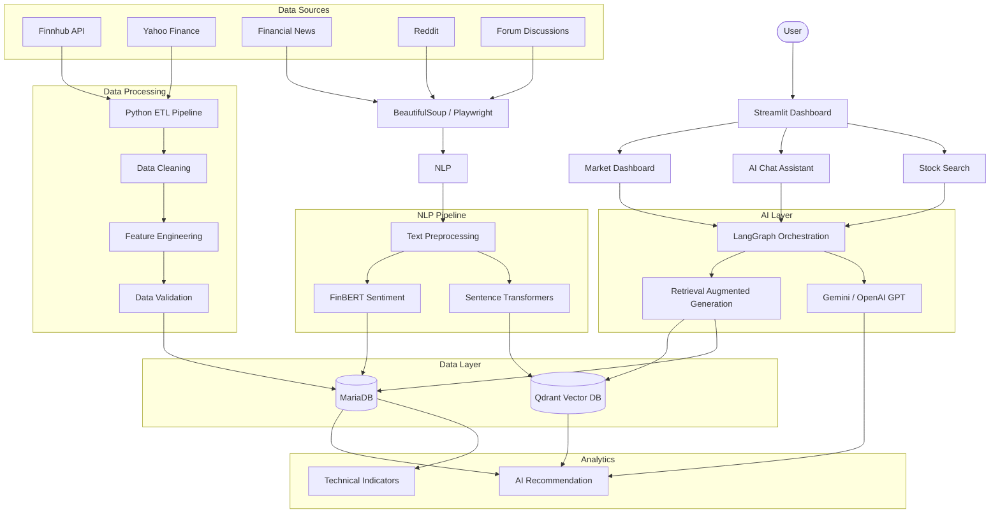

# AI-Powered-Stock-Market-Intelligence-and-Sentiment-Analysis-System
Key Technologies  Python | FastAPI | MariaDB | NLP | FinBERT | Sentence Transformers | LLM APIs | Qdrant | Elasticsearch | Streamlit | BeautifulSoup | Playwright | Git | Docker | REST APIs

#Project Architecture (Version 2.0) 

 #🏗️ Project Architecture

# 🚀 Technology Stack

| Category | Technologies |
|-----------|--------------|
| Language | Python |
| Backend | FastAPI |
| Frontend | Streamlit |
| Database | MariaDB |
| Vector Database | Qdrant |
| LLM | Gemini, OpenAI GPT |
| NLP | FinBERT, Sentence Transformers |
| Framework | LangGraph |
| Search | Semantic Search |
| Web Scraping | BeautifulSoup, Playwright |
| APIs | Finnhub, Yahoo Finance |
| Deployment | Docker |
| Version Control | Git |

# 🏗️ System Architecture

