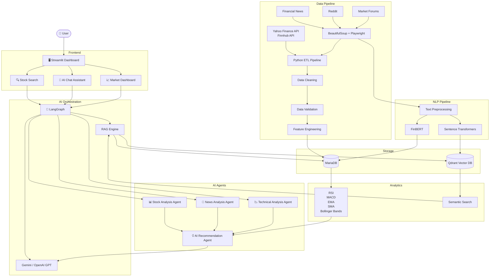

# AI-Powered-Stock-Market-Intelligence-and-Sentiment-Analysis-System
Key Technologies  Python | FastAPI | MariaDB | NLP | FinBERT | Sentence Transformers | LLM APIs | Qdrant | Elasticsearch | Streamlit | BeautifulSoup | Playwright | Git | Docker | REST APIs

#Project Architecture (Version 2.0) 

                         #🏗️ Project Architecture

# 🚀 Technology Stack

| Category | Technologies |
|-----------|--------------|
| Language | Python |
| Backend | FastAPI |
| Frontend | Streamlit |
| Database | MariaDB |
| Vector Database | Qdrant |
| LLM | Gemini, OpenAI GPT |
| NLP | FinBERT, Sentence Transformers |
| Framework | LangGraph |
| Search | Semantic Search |
| Web Scraping | BeautifulSoup, Playwright |
| APIs | Finnhub, Yahoo Finance |
| Deployment | Docker |
| Version Control | Git |

# 🏗️ System Architecture

#📂 Project Structure

AI-Stock-Market-Intelligence/
│
├── README.md
├── requirements.txt
├── .env
├── .gitignore
├── LICENSE
│
├── app.py                          # Streamlit entry point
│
├── config/
│   ├── config.py
│   ├── settings.py
│   └── logging_config.py
│
├── data/
│   ├── raw/
│   ├── processed/
│   ├── cache/
│   └── embeddings/
│
├── database/
│   ├── schema.sql
│   ├── connection.py
│   ├── mariadb.py
│   ├── qdrant_client.py
│   └── crud.py
│
├── data_collection/
│   ├── stock_data/
│   │   ├── finnhub_collector.py
│   │   ├── yahoo_collector.py
│   │   └── scheduler.py
│   │
│   ├── news_data/
│   │   ├── news_api.py
│   │   └── rss_feed.py
│   │
│   ├── scraping/
│   │   ├── reddit_scraper.py
│   │   ├── forum_scraper.py
│   │   ├── beautifulsoup_scraper.py
│   │   └── playwright_scraper.py
│   │
│   └── pipeline.py
│
├── preprocessing/
│   ├── clean_stock_data.py
│   ├── clean_news.py
│   ├── remove_duplicates.py
│   ├── text_preprocessing.py
│   └── feature_engineering.py
│
├── analytics/
│   ├── technical_indicators.py
│   ├── fundamentals.py
│   ├── market_statistics.py
│   └── recommendation_features.py
│
├── sentiment_analysis/
│   ├── finbert_model.py
│   ├── sentiment_pipeline.py
│   └── sentiment_utils.py
│
├── embeddings/
│   ├── embedding_generator.py
│   ├── sentence_transformer.py
│   └── vector_store.py
│
├── rag/
│   ├── retriever.py
│   ├── context_builder.py
│   ├── prompt_template.py
│   └── rag_pipeline.py
│
├── llm/
│   ├── gemini_client.py
│   ├── openai_client.py
│   ├── llm_router.py
│   └── market_summary.py
│
├── agents/
│   ├── langgraph_workflow.py
│   ├── stock_agent.py
│   ├── news_agent.py
│   ├── sentiment_agent.py
│   ├── recommendation_agent.py
│   └── chat_agent.py
│
├── dashboard/
│   ├── home.py
│   ├── stock_dashboard.py
│   ├── market_dashboard.py
│   ├── chatbot.py
│   ├── recommendation.py
│   └── visualization.py
│
├── utils/
│   ├── helper.py
│   ├── constants.py
│   ├── validators.py
│   ├── logger.py
│   └── scheduler.py
│
├── tests/
│   ├── test_api.py
│   ├── test_database.py
│   ├── test_sentiment.py
│   ├── test_embeddings.py
│   ├── test_rag.py
│   └── test_dashboard.py
│
├── docs/
│   ├── architecture.md
│   ├── api_documentation.md
│   ├── database_design.md
│   └── screenshots/
│
└── notebooks/
    ├── EDA.ipynb
    ├── sentiment_analysis.ipynb
    ├── embeddings.ipynb
    └── experimentation.ipynb
